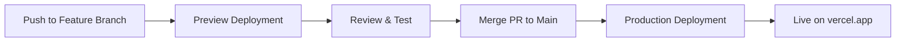

## Overview

[Vercel](https://vercel.com) is the platform built by the creators of Next.js, offering **zero-configuration deployments** for Next.js applications. By connecting your GitHub repository to Vercel, every push to your `main` branch triggers an automatic production deployment.

---

## Step 1: Sign Up or Log In to Vercel

<Steps>
  <Step title="Visit Vercel">
    Go to [vercel.com](https://vercel.com) and click **"Sign Up"** (or **"Log In"** if you already have an account).
  </Step>
  <Step title="Sign Up with GitHub">
    Choose **"Continue with GitHub"** to link your Vercel account directly to your GitHub account. This is the recommended approach for seamless repository access.
  </Step>
  <Step title="Authorize Vercel">
    Grant Vercel the necessary permissions to access your GitHub repositories. You can choose to grant access to all repositories or select specific ones.
  </Step>
</Steps>

<Tip>
  **Why sign up with GitHub?** This creates a direct connection between your GitHub repositories and Vercel, eliminating the need for manual configuration of webhooks or deploy keys.
</Tip>

---

## Step 2: Import Your Repository

<Steps>
  <Step title="Click 'Add New Project'">
    From your Vercel dashboard, click the **"Add New..."** button and select **"Project"**.
  </Step>
  <Step title="Select Your Repository">
    You'll see a list of your GitHub repositories. Find **`my-nextjs-app`** and click **"Import"**.

    
  </Step>
  <Step title="Configure Project Settings">
    Vercel will **automatically detect** that your project uses Next.js and pre-fill the build settings:
    
    | Setting | Value |
    |---------|-------|
    | **Framework Preset** | Next.js |
    | **Build Command** | `next build` |
    | **Output Directory** | `.next` |
    | **Install Command** | `npm install` |
    | **Root Directory** | `./` |

    <Note>
      In most cases, you won't need to change any of these settings. Vercel's framework auto-detection handles everything for Next.js projects.
    </Note>
  </Step>
</Steps>

---

## Step 3: Deploy

Click the **"Deploy"** button. Vercel will:

1. Clone your repository
2. Install dependencies (`npm install`)
3. Build your application (`next build`)
4. Deploy it to a global edge network

The deployment typically takes **30–90 seconds**. Once complete, you'll see a success screen with your live deployment URL.

---

## Step 4: View Your Live Site

After deployment, Vercel provides you with:

- **Production URL:** `https://my-nextjs-app.vercel.app`
- **Deployment URL:** A unique URL for this specific deployment
- **Dashboard:** Build logs, analytics, and deployment history

<Check>
  🎉 **Congratulations!** Your Next.js application is now live on the internet.
</Check>

---

## Understanding Vercel's Deployment Model

Vercel provides three types of deployments:

<CardGroup cols={3}>
  <Card title="Production" icon="globe">
    Deployed when you push to the **`main`** branch. This is your live, public-facing site.
  </Card>
  <Card title="Preview" icon="eye">
    Automatically created for every **pull request**. Each PR gets its own unique URL for testing and review.
  </Card>
  <Card title="Development" icon="laptop-code">
    Your **local development** environment running on `localhost:3000`.
  </Card>
</CardGroup>

---

## Vercel Dashboard Overview

Once your project is connected, the Vercel dashboard gives you access to:

| Feature | Description |
|---------|-------------|
| **Deployments** | View all past deployments with status, duration, and logs |
| **Analytics** | Track page views, web vitals, and performance metrics |
| **Logs** | Real-time serverless function logs and build logs |
| **Settings** | Configure domains, environment variables, and Git integration |
| **Speed Insights** | Measure real-world performance with Core Web Vitals |

---

## Summary

<Check>
  Your GitHub repository is now connected to Vercel with automatic deployments enabled. Every push to `main` will trigger a production deployment, and every pull request will generate a preview deployment.
</Check>

**Next up:** [Managing Environment Variables](/environment-variables) to securely configure your application for different environments.
