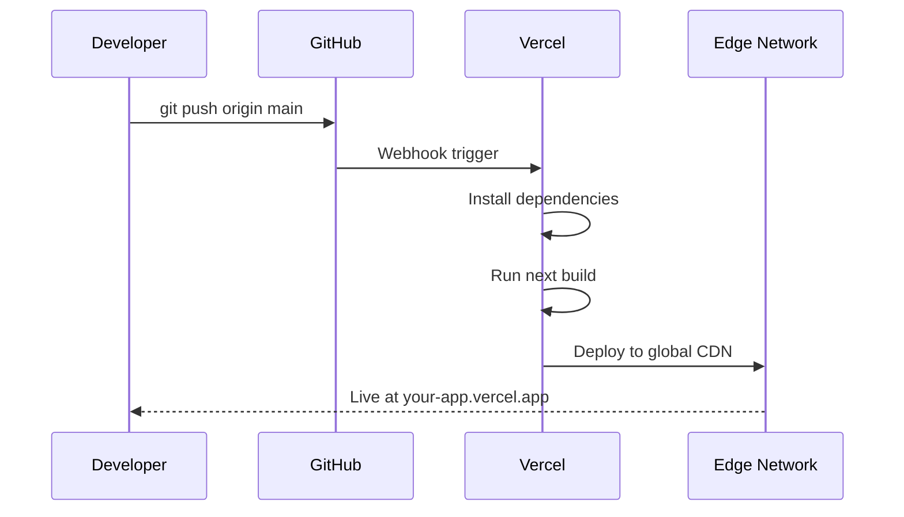

## Overview

With your project connected to Vercel and environment variables configured, you're ready to deploy to **production**. This chapter covers the full deployment lifecycle — from pushing code to monitoring your live application.

---

## Automatic Deployments

Once your GitHub repository is connected, Vercel deploys your application **automatically**:



<Tip>
  Every push to your `main` branch triggers a **production deployment**. Pushes to other branches or pull requests create **preview deployments** with unique URLs.
</Tip>

---

## Step 1: Push Changes to Deploy

To deploy your latest changes, simply commit and push to `main`:

```bash
# Stage all changes
git add .

# Commit with a descriptive message
git commit -m "feat: update homepage with hero section"

# Push to trigger deployment
git push origin main
```

Within seconds, Vercel will pick up the push and start building your application.

---

## Step 2: Monitor the Build

You can watch the build progress in real-time:

<Steps>
  <Step title="Open the Vercel Dashboard">
    Navigate to your project at [vercel.com/dashboard](https://vercel.com/dashboard).
  </Step>
  <Step title="View Deployment Details">
    Click on the latest deployment to see:
    - **Build Logs** — Real-time output from `npm install` and `next build`
    - **Function Logs** — Serverless function execution logs
    - **Build Duration** — How long the deployment took
    - **Source** — Which commit triggered the deployment
  </Step>
</Steps>


### Interpreting Build Output

```
▲  Vercel CLI 35.0.0

🔍  Inspecting project settings...
📦  Installing dependencies...
🔨  Building project...
   ✓ Compiled successfully
   ✓ Linting and checking validity of types
   ✓ Collecting page data
   ✓ Generating static pages (5/5)
   ✓ Finalizing page optimization

🎉  Build completed successfully!

📡  Deploying to production...
✅  Production: https://my-nextjs-app.vercel.app [28s]
```

---

## Step 3: Preview Deployments

Every **pull request** automatically gets a preview deployment:

<Steps>
  <Step title="Create a Feature Branch">
    ```bash
    git checkout -b feature/about-page
    ```
  </Step>
  <Step title="Make Changes and Push">
    ```bash
    # Make your changes
    git add .
    git commit -m "feat: add about page"
    git push origin feature/about-page
    ```
  </Step>
  <Step title="Open a Pull Request">
    Create a pull request on GitHub. Vercel will automatically:
    - Build the PR branch
    - Deploy it to a unique preview URL
    - Post a comment on the PR with the preview link
  </Step>
  <Step title="Review and Merge">
    Test your changes using the preview URL. Once approved, merge the PR to trigger a production deployment.
  </Step>
</Steps>


---

## Step 4: Set Up a Custom Domain

By default, your app is available at `your-project.vercel.app`. To use your own domain:

<Steps>
  <Step title="Navigate to Domain Settings">
    In your Vercel project, go to **Settings** → **Domains**.
  </Step>
  <Step title="Add Your Domain">
    Enter your custom domain (e.g., `myapp.com`) and click **Add**.
  </Step>
  <Step title="Configure DNS">
    Vercel will provide DNS records to add at your domain registrar:
    
    | Type | Name | Value |
    |------|------|-------|
    | **A** | `@` | `76.76.21.21` |
    | **CNAME** | `www` | `cname.vercel-dns.com` |
  </Step>
  <Step title="Verify and Enable SSL">
    Once DNS propagates (usually within minutes), Vercel will **automatically provision an SSL certificate** for your domain. Your site will be accessible via HTTPS.
  </Step>
</Steps>

<Note>
  Vercel supports **apex domains** (`myapp.com`), **subdomains** (`app.myapp.com`), and **wildcard domains** (`*.myapp.com`). SSL certificates are always free and auto-renewed.
</Note>

---

## Step 5: Rollback a Deployment

If a deployment introduces issues, you can instantly rollback:

<Steps>
  <Step title="Go to Deployments">
    In your Vercel dashboard, click on the **Deployments** tab.
  </Step>
  <Step title="Find the Previous Good Deployment">
    Locate the last known working deployment in the list.
  </Step>
  <Step title="Promote to Production">
    Click the **three-dot menu** (⋯) next to the deployment and select **"Promote to Production"**. Your site will instantly revert to the previous version.
  </Step>
</Steps>

<Tip>
  Rollbacks are **instant** because Vercel keeps all previous deployment artifacts. No rebuild is required.
</Tip>

---

## Step 6: Monitor Your Application

After deployment, use Vercel's built-in tools to monitor performance:

<CardGroup cols={2}>
  <Card title="Analytics" icon="chart-line">
    Track page views, unique visitors, and top pages. Available under the **Analytics** tab in your project dashboard.
  </Card>
  <Card title="Speed Insights" icon="gauge-high">
    Monitor **Core Web Vitals** — LCP, FID, CLS — with real-user data. Identify performance bottlenecks and optimize accordingly.
  </Card>
  <Card title="Logs" icon="terminal">
    View real-time logs from your serverless functions and edge middleware. Filter by status code, path, or time range.
  </Card>
  <Card title="Alerts" icon="bell">
    Set up notifications for deployment failures, performance regressions, or usage threshold alerts via email, Slack, or webhooks.
  </Card>
</CardGroup>

---

## Deployment Checklist

Before deploying to production, ensure you've completed these steps:

<Steps>
  <Step title="Code Quality">
    - ✅ All linting errors resolved (`npm run lint`)
    - ✅ TypeScript compiles without errors (`npx tsc --noEmit`)
    - ✅ All tests pass
  </Step>
  <Step title="Environment Variables">
    - ✅ All required variables are set in the Vercel dashboard
    - ✅ No secrets are committed to the repository
    - ✅ `NEXT_PUBLIC_` prefix is correctly applied
  </Step>
  <Step title="Performance">
    - ✅ Images are optimized using `next/image`
    - ✅ Fonts are loaded with `next/font`
    - ✅ Metadata is configured for SEO
  </Step>
  <Step title="Security">
    - ✅ HTTPS is enabled (automatic with Vercel)
    - ✅ Security headers are configured
    - ✅ API routes have proper authentication
  </Step>
</Steps>

---

## Quick Reference: Vercel CLI Commands

For developers who prefer the command line:

```bash
# Install the Vercel CLI
npm i -g vercel

# Deploy to preview
vercel

# Deploy to production
vercel --prod

# View deployment status
vercel ls

# View build logs
vercel logs <deployment-url>

# Pull environment variables
vercel env pull .env.local

# Add a custom domain
vercel domains add myapp.com
```

---

## Summary

<Check>
  🎉 **You've completed the guide!** Your Next.js application is now:
  
  - ✅ Built with the latest Next.js features
  - ✅ Version-controlled on GitHub
  - ✅ Connected to Vercel for automatic deployments
  - ✅ Configured with secure environment variables
  - ✅ Deployed to production with monitoring enabled
</Check>

### What's Next?

<CardGroup cols={3}>
  <Card title="Next.js Documentation" icon="book" href="https://nextjs.org/docs">
    Explore advanced features like middleware, ISR, and server actions.
  </Card>
  <Card title="Vercel Documentation" icon="rocket" href="https://vercel.com/docs">
    Learn about edge functions, cron jobs, and storage solutions.
  </Card>
  <Card title="Next.js Examples" icon="code" href="https://github.com/vercel/next.js/tree/canary/examples">
    Browse official examples for authentication, databases, and more.
  </Card>
</CardGroup>
